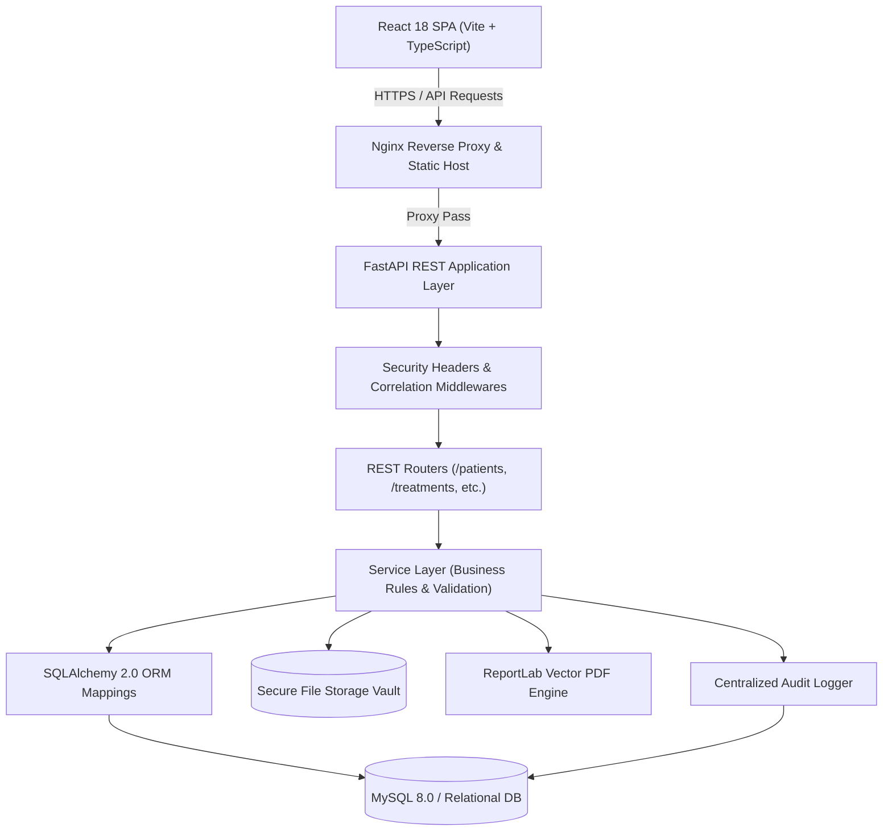
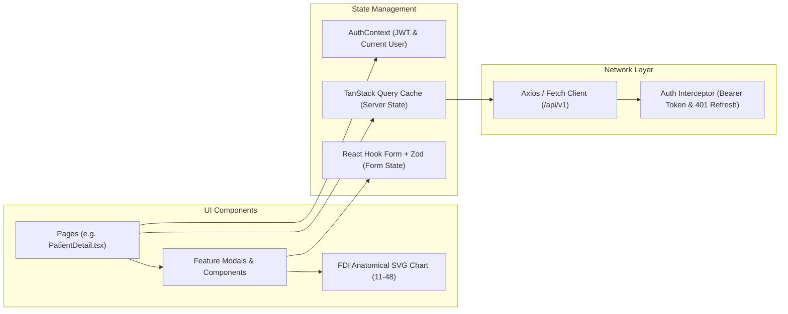
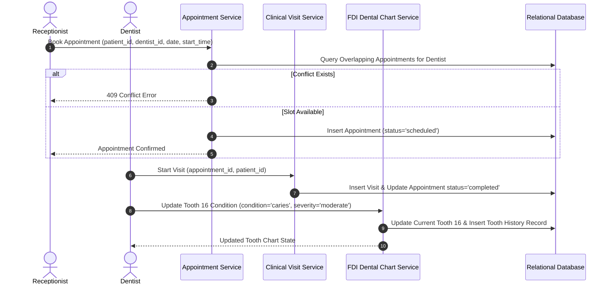

# Apex Dental Care - System Architecture Document

## 1. Architectural Philosophy & Overview

Apex Dental Care is architected as a **stateless, micro-service ready, modular monolith**. The system decouples presentation, orchestration, and persistence into clear architectural layers, ensuring that business logic is strictly isolated from HTTP delivery protocols.

---

## 2. Layered Backend Design

The backend enforces strict separation of concerns across 5 distinct tiers:

### 1. Delivery Tier (`app/routers/`)
- Pure HTTP handling: Parameter deserialization, request schema validation, status code assignment, and content negotiation.
- Implements dependency injection for user authentication (`get_current_user`) and RBAC verification (`require_roles`).
- Zero direct database mutations or business calculations occur within routers.

### 2. Service Tier (`app/services/`)
- Contains 100% of domain business logic.
- Atomic business transactions, conflict detection (e.g. appointment double-booking), financial aggregations, and tooth condition history creation.
- Explicit transactional scope management with automated rollbacks on failure.

### 3. Model & Persistence Tier (`app/models/` & `app/database.py`)
- Declarative SQLAlchemy 2.0 ORM entity definitions.
- Explicit foreign keys, unique composite indexes, soft-delete flags (`is_deleted`), and timestamp tracking (`created_at`, `updated_at`).
- All currency columns defined as `Numeric(10, 2)` to eliminate floating-point arithmetic errors.

### 4. Security Tier (`app/security/`)
- Cryptographic password hashing using standard Argon2id / Bcrypt implementations.
- JWT access token minting and cryptographic verification.
- Cryptographically random refresh token generation with SHA-256 hash storage in the database.
- Declarative role-permission matrix.

### 5. Cross-Cutting Utilities (`app/audit/`, `app/pdf/`, `app/storage/`)
- **Centralized Audit Logger:** Automatically captures mutating events with recursive sensitive-data sanitization.
- **ReportLab PDF Generator:** Generates compliant vector PDF documents with clinic branding.
- **Storage Abstraction:** Protects uploads with UUID renaming, MIME verification, and path traversal guards.

---

## 3. Frontend Architecture

The frontend is built on React 18, TypeScript, and Vite, prioritizing predictable state management and minimal re-renders:

### Server State vs Local UI State
- **Server State:** Managed exclusively through `@tanstack/react-query` with declarative query keys (e.g. `['patient', id]`, `['treatmentPlans', status]`). Mutations invalidate corresponding cache keys to trigger re-renders without manual state synchronization.
- **Form State:** Managed with controlled inputs and strict validation schemas.
- **Global Context:** Reserved strictly for authentication session tokens and active user profile.

---

## 4. Clinical Workflow Sequences

### Appointment & Examination Lifecycle

---

## 5. Security & Isolation Boundaries

1. **Network Boundary:** The database (`apex_dental_mysql`) is placed in an internal Docker network and is inaccessible from the public internet.
2. **Access Boundary:** Reverse proxy (Nginx) terminates external HTTP requests and applies security headers before forwarding traffic to the application server.
3. **Application Boundary:** Every sensitive route verifies both authentication (valid JWT signature and unexpired token) and authorization (user's role matches required endpoint permission).
