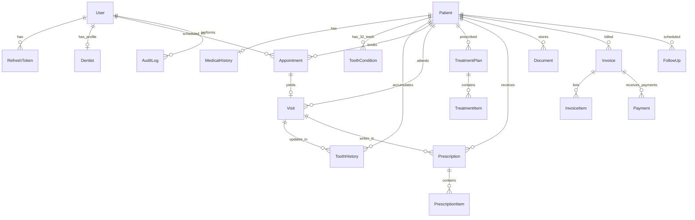

# Apex Dental Care - Database Schema & Persistence Guide

## 1. Entity Relationship Diagram



---

## 2. Table Specifications & Indexes

### `users`
- Primary identity store for clinicians and administrative staff.
- Columns: `id` (PK), `email` (Unique, indexed), `username` (Unique, indexed), `hashed_password`, `full_name`, `role` (indexed), `phone`, `is_active`, `failed_login_attempts`, `locked_until`, `created_at`, `updated_at`.

### `dentists`
- Clinician specific profile details.
- Columns: `id` (PK), `user_id` (FK -> `users.id`, Unique), `license_number` (Unique, indexed), `specialization`, `qualifications`, `cabin_number`, `is_active`.

### `patients`
- Primary patient demographic records.
- Columns: `id` (PK), `patient_id` (Unique, indexed, e.g. `PAT-2026-0001`), `first_name`, `last_name` (indexed), `date_of_birth`, `gender`, `phone` (indexed), `email`, `address`, `emergency_contact_name`, `emergency_contact_phone`, `is_deleted` (soft-delete flag), `created_at`, `updated_at`.

### `teeth` (`tooth_conditions`)
- Stores current clinical status for each permanent tooth (11 to 48) per patient.
- Initialized with 32 permanent teeth upon patient registration.
- Columns: `id` (PK), `patient_id` (FK -> `patients.id`, indexed), `tooth_number` (indexed, 11-48), `condition` (indexed, default 'healthy'), `severity`, `surfaces`, `notes`, `updated_at`.
- Unique constraint: `(patient_id, tooth_number)`.

### `tooth_history`
- Append-only immutable log of every tooth examination or procedure.
- Columns: `id` (PK), `patient_id` (FK), `visit_id` (FK, nullable), `dentist_id` (FK), `tooth_number`, `condition`, `severity`, `surfaces`, `notes`, `created_at` (indexed).

### `appointments`
- Clinic consultation schedule.
- Columns: `id` (PK), `patient_id` (FK), `dentist_id` (FK, indexed), `appointment_date` (indexed), `start_time`, `end_time`, `status` (indexed), `appointment_type_id`, `reason`, `notes`, `created_at`.
- Index: `(dentist_id, appointment_date, start_time)` for fast conflict detection.

### `treatment_plans` & `treatment_items`
- Multi-procedure care plans with cost estimates.
- `treatment_plans`: `id` (PK), `patient_id` (FK), `dentist_id` (FK), `title`, `status`, `notes`, `created_at`.
- `treatment_items`: `id` (PK), `treatment_plan_id` (FK), `procedure_name`, `tooth_number`, `estimated_cost` (`Numeric(10, 2)`), `actual_cost` (`Numeric(10, 2)`), `status`, `notes`.

### `invoices`, `invoice_items` & `payments`
- Financial records with atomic transaction calculations.
- `invoices`: `id` (PK), `invoice_number` (Unique, indexed), `patient_id` (FK), `issue_date`, `due_date`, `subtotal` (`Numeric(10, 2)`), `discount` (`Numeric(10, 2)`), `tax` (`Numeric(10, 2)`), `total` (`Numeric(10, 2)`), `paid_amount` (`Numeric(10, 2)`), `balance` (`Numeric(10, 2)`), `status` (indexed).
- `payments`: `id` (PK), `invoice_id` (FK), `patient_id` (FK), `amount` (`Numeric(10, 2)`), `payment_method` (`cash`, `card`, `upi`, `bank_transfer`), `transaction_reference`, `payment_date` (indexed).

### `audit_logs`
- Centralized compliance audit trail.
- Columns: `id` (PK), `user_id` (FK, nullable), `user_email` (indexed), `action` (indexed), `entity_name` (indexed), `entity_id` (indexed), `details` (JSON text), `ip_address`, `user_agent`, `created_at` (indexed).

---

## 3. Financial Precision & Integrity Rules

1. **Zero Floating-Point Drift:** All money columns use SQL `Numeric(10, 2)` mapped to Python `Decimal`. Floating-point arithmetic (`float`) is strictly prohibited in services and database models.
2. **Transactional Ledger Balance Calculation:**
   $$\text{balance} = \text{total} - \sum (\text{valid payments})$$
   When a payment transaction is recorded, it executes within an atomic database transaction.
3. **No Accidental Clinical Cascade Deletes:** Foreign keys connecting Patients to Visits, Tooth Conditions, Invoices, and Prescriptions employ `ON DELETE RESTRICT` or soft deletion semantics. A patient deletion archives the account (`is_deleted = True`) without destroying past clinical history.

---

## 4. Alembic Migration Commands

```bash
cd backend

# Generate a new migration after model modifications
alembic revision --autogenerate -m "describe_changes"

# Apply pending migrations to database
alembic upgrade head

# Rollback one migration step
alembic downgrade -1

# Show migration history
alembic history --verbose
```
