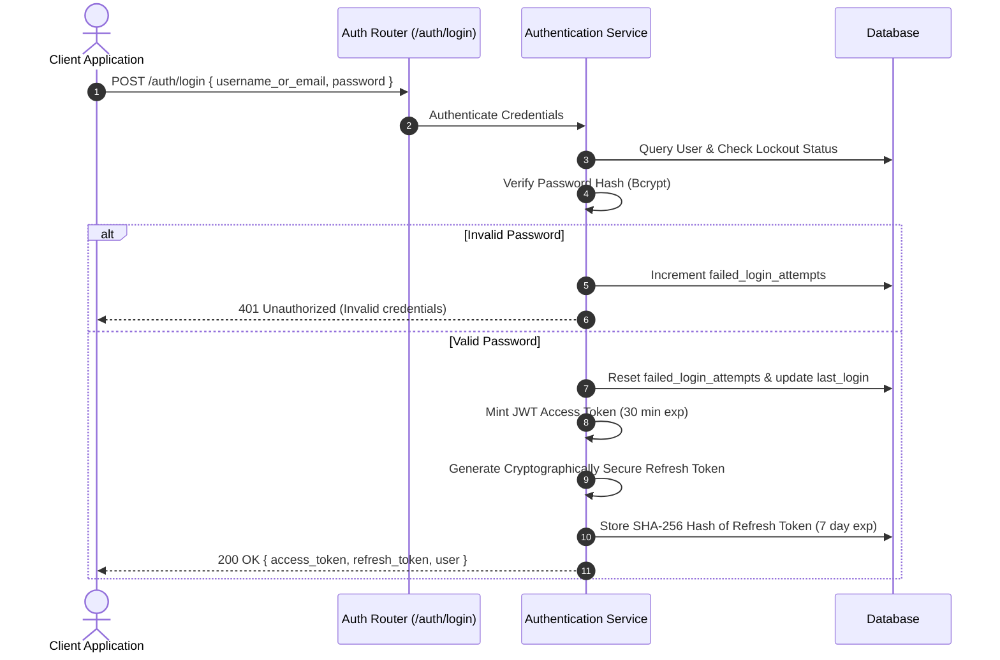

# Apex Dental Care - Security Architecture & Threat Model

## 1. Overview & Threat Model

Patient health information (PHI) and clinical records require rigorous, defense-in-depth protection. The security model adheres to HIPAA Security Rule guidelines and OWASP Top 10 recommendations.

| Threat Category | Potential Risk | Mitigation in Apex Dental Care |
|---|---|---|
| **Injection (SQLi)** | Malicious SQL payloads in searches | SQLAlchemy 2.0 parameterized queries exclusively. Zero raw SQL string concatenation. |
| **Broken Access Control** | Receptionist updating diagnosis or patient accessing another patient's records | Backend-enforced RBAC dependencies (`require_roles`). IDOR prevention checking patient context. |
| **Authentication Failures** | Brute-force attacks, token forgery | Bcrypt password hashing, short-lived JWT access tokens (30m), single-use refresh token rotation with SHA-256 storage, account lockout after 5 consecutive failed logins. |
| **Cryptographic Failures** | Data leakage over unencrypted channels | HTTPS enforcement, TLS 1.3 in production, secure HTTP-only cookies, no sensitive plaintext in logs. |
| **Security Misconfiguration** | Stack trace leaks, default credentials | Custom exception handlers returning uniform sanitized JSON errors. Production config validation at startup. |
| **Vulnerable & Outdated Components** | Vulnerabilities in third-party libraries | Automated CI dependency auditing, pinning locked versions in `requirements.txt` and `package-lock.json`. |
| **Path Traversal / Malicious Uploads** | Overwriting server files via uploaded X-rays | Extension and MIME-type verification, server-generated UUID filenames, files stored strictly outside web root. |

---

## 2. Role-Based Access Control (RBAC) Matrix

Permissions are strictly enforced on backend endpoints regardless of client interface state:

| Resource / Action | Administrator | Dentist | Receptionist | Patient (Future Portal) |
|---|:---:|:---:|:---:|:---:|
| **Patient Registration** | ✅ Create / Read / Update | ✅ Read | ✅ Create / Read / Update | ❌ |
| **Patient Demographics** | ✅ Full Access | ✅ Full Access | ✅ View / Edit Basic | ✅ View Self Only |
| **Medical & Dental Alerts** | ✅ Full Access | ✅ Full Access | ✅ View Warnings | ✅ View Self Only |
| **Schedule Appointment** | ✅ Full Access | ✅ View Schedule | ✅ Create / Reschedule / Cancel | ❌ |
| **Clinical Examination & Vitals** | ✅ View | ✅ Create / Edit | ❌ Denied (403) | ❌ Denied (403) |
| **FDI Tooth Chart (11–48)** | ✅ View History | ✅ Update Condition | ❌ Denied (403) | ❌ Denied (403) |
| **Treatment Plans** | ✅ View | ✅ Create / Update Item | ❌ Denied (403) | ❌ Denied (403) |
| **Prescriptions & PDF** | ✅ View / Download | ✅ Create / Download | ❌ Denied (403) | ✅ Download Self Only |
| **Upload X-Rays / Documents** | ✅ Upload / Download | ✅ Upload / Download | ✅ Upload / Download | ❌ Denied (403) |
| **Invoices & Billing** | ✅ Full Access | ✅ View | ✅ Create / Add Payments | ✅ View Self Only |
| **Audit Logs Inspection** | ✅ Full Access | ❌ Denied (403) | ❌ Denied (403) | ❌ Denied (403) |
| **User & Staff Management** | ✅ Full Access | ❌ Denied (403) | ❌ Denied (403) | ❌ Denied (403) |

---

## 3. Authentication & Session Security

### Key Security Safeguards
1. **Token Invalidation:** When a refresh token is exchanged or revoked (`POST /auth/logout`), the token's hash is immediately marked `is_revoked = True` in the database.
2. **Account Lockout:** 5 consecutive failed login attempts trigger an automated 15-minute account lock (`locked_until`).
3. **No Credential Logging:** Passwords, JWT tokens, and refresh tokens are strictly scrubbed prior to audit trail recording.

---

## 4. Secure File Storage & Download Pipeline

Uploaded clinical documents and panoramic radiographs are protected through a 6-stage verification pipeline:

1. **Size Verification:** Uploads exceeding `15 MB` (`15,728,640` bytes) are rejected with `413 Payload Too Large`.
2. **Extension Allowlist:** Only verified extensions are permitted (`.jpg`, `.jpeg`, `.png`, `.pdf`, `.dcm`, `.tiff`).
3. **Magic Byte / MIME Verification:** The file's MIME type is inspected to prevent executable masquerading.
4. **Server-Side File Renaming:** Files are renamed to randomly generated UUIDv4 filenames (e.g. `d3b07384-d113-4632-9c93-4a6c4293fe2a.png`) to prevent path traversal (`../`) and local file inclusion (LFI).
5. **Storage Outside Web Root:** Files are stored in an isolated storage directory (`./uploads/`) that is never directly served as a static route.
6. **Authorized Streaming:** The download endpoint (`GET /documents/{id}/download`) authenticates the user, verifies role permissions, logs an audit record, and streams the file securely with `FileResponse`.

---

## 5. Security Vulnerability Reporting

To report a suspected security vulnerability, please contact our security team at `security@apexdental.com`. We respond within 24 hours and practice coordinated disclosure.
